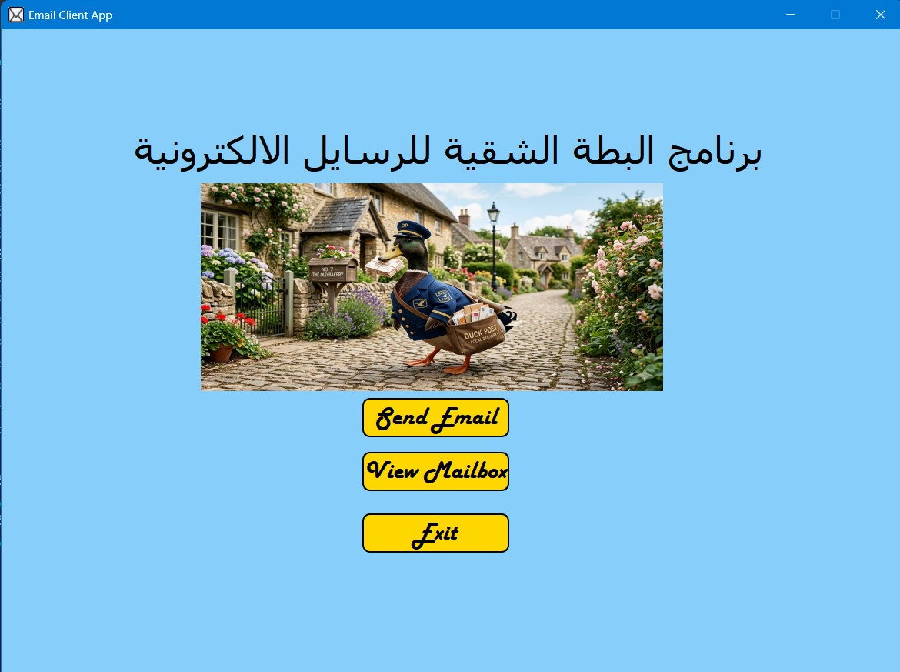
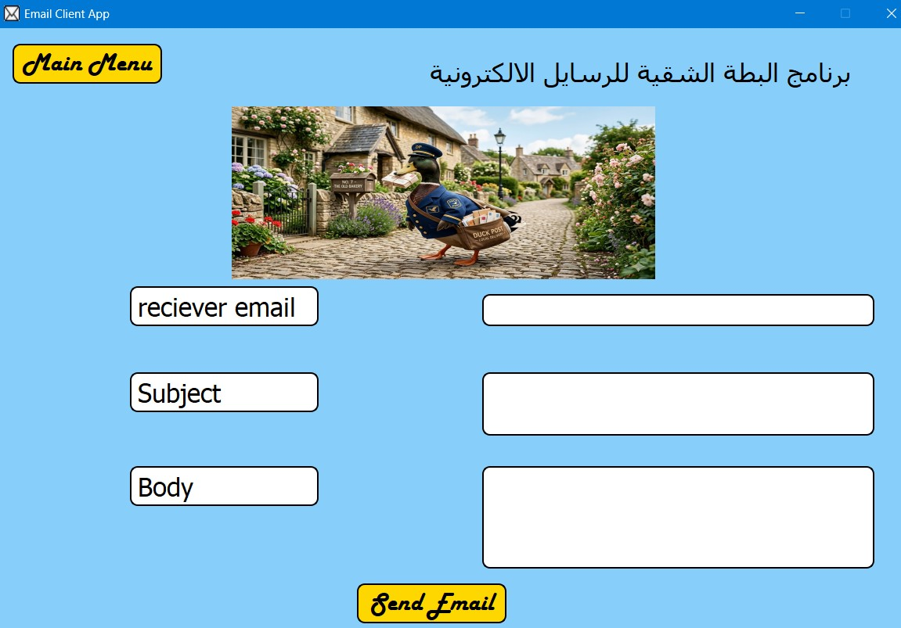
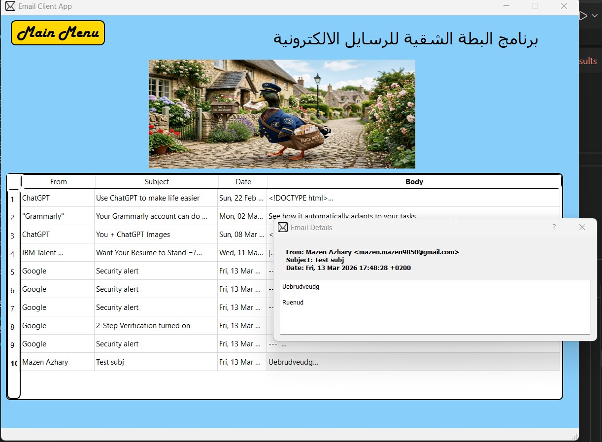
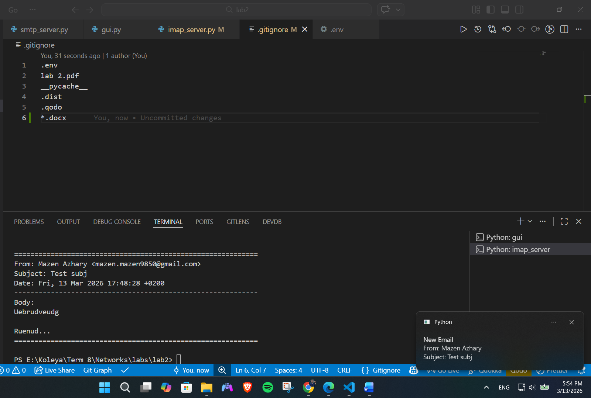

# Email Sender Reciever Desktop App

This project is a desktop email client built with Python and PyQt5 that allows you to send and receive emails using your Gmail account. The application integrates IMAP for fetching emails and SMTP for sending emails, providing a simple graphical interface to manage your inbox.

---

## Features

- **Send Emails** – Compose and send plain-text emails via SMTP.
- **Receive Emails** – Fetch the latest emails from your Gmail inbox using IMAP.
- **Desktop Notifications** – Receive Windows notifications for new emails (from the fetched list).
- **Email Details View** – Click on any email in the list to view its full content in a separate dialog.
- **Clean GUI** – Built with PyQt5 and designed using Qt Designer.
- **Secure Credentials** – Email login details are stored in an environment file (`.env`).

---

## Technologies Used

- **Python 3.8+**
- **PyQt5** – GUI framework
- **IMAP (imaplib)** – Fetch emails from Gmail
- **SMTP (smtplib)** – Send emails via Gmail
- **html2text** – Convert HTML email bodies to plain text
- **python-dotenv** – Load environment variables
- **plyer** – Desktop notifications

---

## Prerequisites

- Python 3.8 or higher
- A Gmail account with **"Allow less secure apps"** turned off (use an [App Password](https://support.google.com/accounts/answer/185833) instead)

---

## Installation

1. **Clone the repository**

   ```bash
   git clone https://github.com/yourusername/email-client-pyqt5.git
   cd email-client-pyqt5
   ```
2. **Create a virtual environment** (recommended):

   ```bash
   python -m venv venv
   source venv/bin/activate   # On Windows: venv\Scripts\activate
   ```
3. **Install dependencies**:

   ```bash
   pip install PyQt5 python-dotenv html2text plyer
   ```
4. **Set up environment variables**:

   - Create a `.env` file in the project root.
   - Add your Gmail credentials (use an [App Password](https://support.google.com/accounts/answer/185833) if you have 2FA enabled):

     ```text
     EMAIL_USERNAME=your_email@gmail.com
     EMAIL_PASSWORD=your_app_password
     ```
   - (Optional) For testing SMTP separately, you can also add:

     ```text
     RECEIVER_EMAIL=recipient@example.com
     ```
5. **Qt Designer UI file**:

   - The GUI uses `ui.ui` (created with Qt Designer). Ensure it is in the same directory as `gui.py`.

---

## Usage

Run the main application:

```bash
python gui.py
```

### GUI Navigation

- **Main Menu** – Choose between **Send Email** and **View Mailbox**.
- **Send Email** – Fill in the recipient, subject, and body, then click **Send**.
- **View Mailbox** – Fetches the latest 10 emails and displays them in a table. Click any row to see the full email content.
- **Back to Menu** – Return to the main menu at any time.

---

## File Structure

text

```.
├── gui.py                # Main PyQt5 GUI application
├── imap_server.py        # IMAP class for fetching emails
├── smtp_server.py        # SMTP class for sending emails
├── ui.ui                 # Qt Designer UI file (required by gui.py)
├── .env                  # Environment variables (not committed)
└── README.md             # This file
```

### Key Classes

- **`imap_server`** – Handles connection to Gmail's IMAP server, fetches emails, extracts body (converts HTML to text), and sends desktop notifications.
- **`smtp_server`** – Handles sending emails via Gmail's SMTP server.
- **`GUII` (PyQt5)** – Main window with stacked widgets for menu, send page, and view page.
- **`EmailDetailDialog`** – Popup dialog showing full email details when a row is clicked.

---

## Screenshots

Main Menu

Send Emails Menu

View Mails

Notification System

---

## Configuration Notes

- **Gmail Security**:Google no longer supports simple username/password login for less secure apps. You **must** enable 2‑factor authentication and create an [App Password](https://support.google.com/accounts/answer/185833). Use that app password in your `.env` file.
- **IMAP & SMTP settings**:The code uses `imap.gmail.com` (port 993) and `smtp.gmail.com` (port 587). These are standard for Gmail.
- **Email Limit**:
  By default, `fetch_emails(limit=10)` retrieves the 10 most recent emails if there are 10 emails in the mailbox.

---

## License

This project is open source and available under the [MIT License](https://license/).# Email Client with PyQt5 (IMAP & SMTP)

A desktop email client built with Python and PyQt5 that allows you to send and receive emails using your Gmail account. The application integrates IMAP for fetching emails and SMTP for sending emails, providing a simple graphical interface to manage your inbox.

---
